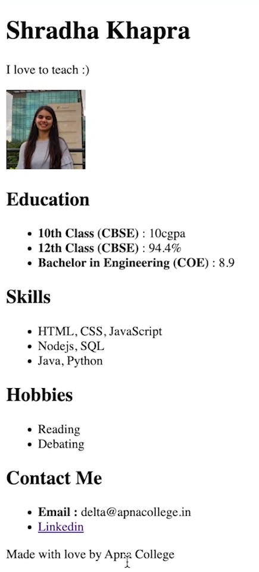

### 1st - List Html Tags
- it's 'ul' and 'li' tag. ul is unordered list and li is list item.
- it's 'ol' and 'li' tags. ol is ordered list and list items.
- i can put "type='A'" in ol tag to make letters in uppercase. this is Attribute as in class or id.

### 2nd - Attributes
- adding more information about tags.
- i know..... everything is Called Attribute.

### 3rd - Anchor Tag - Html ma vanne tarika for link tag.
- it's 'href' attribute which links to other pages.
- eg: '<a href="https://www.google.com">Google</a>'
- we need to put https:// or else it will try to search in your computer.
- target="_blank" opens link in new tab.
- let's not talk about relative link in this video re we will learn it later.

### 4th - Image Tag - Html ma vanne tarika for image.
- this is single tag. 'src' attribute will link to image.
- the src will search in Same Folder if just name of image is given.
- eg: ''
- 'alt' attribute is alternative text if image doesn't load.

### 5th - Practice Question.
- this shows usage of h1 tag, ul, li, a tag, no img but underline for link.

### 6th - More Html Tags.
- 'br' tag. this breaks line and this is single tag. i know.
- in 'p' tag, it doesn't register spaces and line break.
- 'i', 'b', 'u' tag. i know.
- 'strong' tag. this makes text bold. same as bold but it's more important.

### 7th - Comments
- we don't need to give attention like other people commenting to us. same here. just extra info that may be right or i might disagree.
- we write comments in html using '<!--' with commend here '-->' tags. 
- comments are ignored by browser.
- ctrl + / to comment multiple lines. this is forward slash. it's trying to lean forward.
- ***MDN website*** re, we can find more info about html tags about htmls css or js.
- search ordered list MDN then we can learn more about complex stuff. this is professional website

### 8th - Case Sensetive 
- html tags are case insensitive. or not case sensetive. we can write them in uppercase or lowercase. it's about tags and it doesn't matter.
- but we should write them in lowercase. it's good practice.
- but js or css is case sensitive. we should write them in lowercase.

### 9th - Practice 
- create own portfolio page re. it's about add name, pic on top, add sections for my education, skills, hobbies and contact. 
- it's like we marketing our skills for market. we can show our skills to employers.

- learned about "heart Symbol Html" that are made for html to have EMOTES.

THINK what can i Improve More, THINK and Understand Things, THINK by yourself and Practice More to get Better. 
